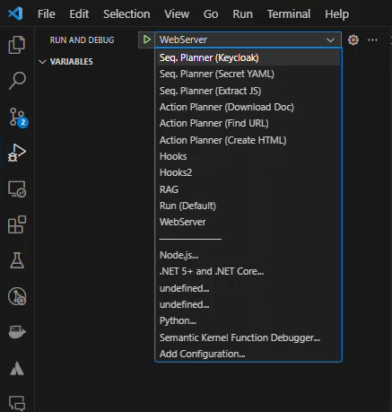
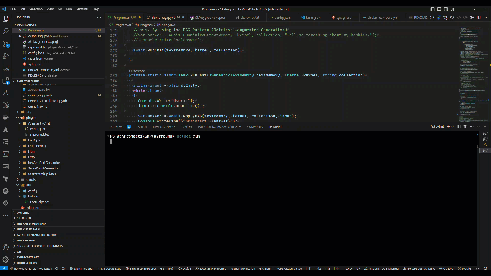
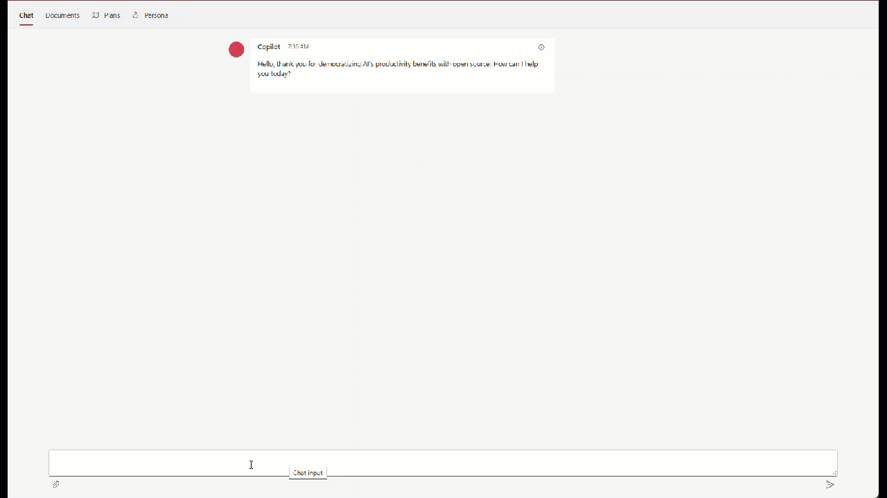
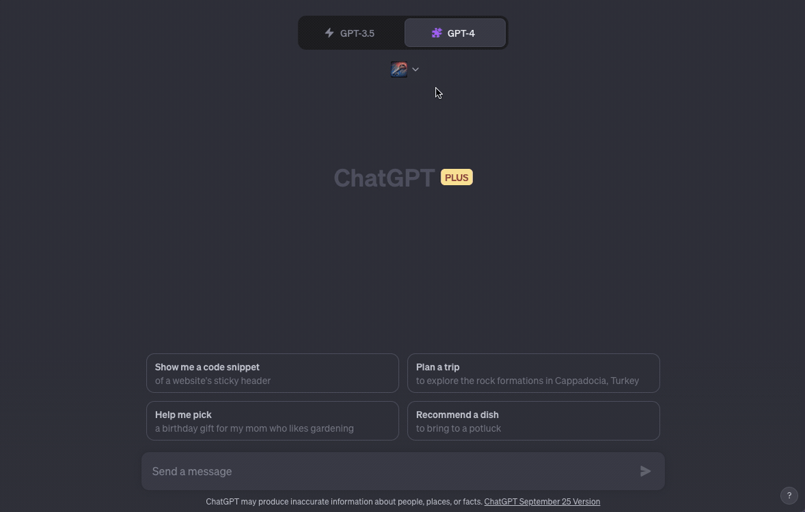

## Welcome to SK Playground! 

This project leverages the power of the Microsoft [Semantic Kernel](https://github.com/microsoft/semantic-kernel/tree/main) to interact with the [OpenAI](https://openai.com/) API.

- [Welcome to SK Playground!](#welcome-to-sk-playground)
- [Companion Article Series](#companion-article-series)
- [Project Structure](#project-structure)
- [Core Features](#core-features)
    - [Assistant Plugin](#assistant-plugin)
    - [DevOps Plugin](#devops-plugin)
    - [Engineering Plugin](#engineering-plugin)
    - [Html Plugin](#html-plugin)
    - [Http Plugin](#http-plugin)
    - [KeyAndCertGenerator Plugin](#keyandcertgenerator-plugin)
    - [SecretYamlGenerator Plugin](#secretyamlgenerator-plugin)
    - [SecretYamlUpdater Plugin](#secretyamlupdater-plugin)
    - [TextMemoryEx Plugin (based on TextMemoryPlugin from SK)](#textmemoryex-plugin-based-on-textmemoryplugin-from-sk)
- [Usage Examples](#usage-examples)
    - [Generating C# Project README](#generating-c-project-readme)
    - [Generating TypeScript Project README](#generating-typescript-project-readme)
    - [Generating Kubernetes YAML](#generating-kubernetes-yaml)
    - [Generating Helm Charts for Keycloak Deployment](#generating-helm-charts-for-keycloak-deployment)
    - [Plugin Configuration](#plugin-configuration)
- [Input Files](#input-files)
    - [Hashing Application in C#](#hashing-application-in-c)
    - [Deploy a Keycloak Helm Chart](#deploy-a-keycloak-helm-chart)
    - [Deploy Keycloak in Prod Mode to Kubernetes](#deploy-keycloak-in-prod-mode-to-kubernetes)
- [Function and Plugin Organization](#function-and-plugin-organization)
    - [Configuration via `appsettings.plugins.json`](#configuration-via-appsettingspluginsjson)
    - [Configuration via `appsettings.json`](#configuration-via-appsettingsjson)
- [Jupyter Notebook Environment](#jupyter-notebook-environment)
    - [Getting Started with Jupyter Notebooks](#getting-started-with-jupyter-notebooks)
    - [Working with Libraries and Dependencies in C# Notebooks](#working-with-libraries-and-dependencies-in-c-notebooks)
- [Scripts Usage](#scripts-usage)
    - [Helm Function Output Processing](#helm-function-output-processing)
    - [Kubernetes Function Output Processing](#kubernetes-function-output-processing)
    - [Practice: Generating a Helm Chart](#practice-generating-a-helm-chart)
- [Extras](#extras)
    - [TextMemoryEx Plugin](#textmemoryex-plugin)
- [Showroom](#showroom)
    - [Action Planner](#action-planner)
    - [Sequential Planner](#sequential-planner)
    - [Hooks](#hooks)
    - [Jupyter Notebook](#jupyter-notebook)
  - [Retrieval Augmented Generation (RAG)](#retrieval-augmented-generation-rag)
  - [ChatGPT Plugins with Chat Copilot](#chatgpt-plugins-with-chat-copilot)
  - [ChatGPT Plugins with ChatGPT](#chatgpt-plugins-with-chatgpt)
  - [LICENSE](#license)

## Companion Article Series
This repository serves as a companion to a series of articles discussing the integration and utilization of Semantic Kernel. These articles provide deeper insights into the concepts and functionalities demonstrated in this repository.

- [Intro to Semantic Kernel - Part One](https://blog.brakmic.com/intro-to-semantic-kernel-part-one) 
- [Intro to Semantic Kernel - Part Two](https://blog.brakmic.com/intro-to-semantic-kernel-part-two)
- [Intro to Semantic Kernel - Part Three](https://blog.brakmic.com/intro-to-semantic-kernel-part-three)
- [Intro to Semantic Kernel - Part Four](https://blog.brakmic.com/intro-to-semantic-kernel-part-four)
- [Intro to Semantic Kernel - Part Five](https://blog.brakmic.com/intro-to-semantic-kernel-part-five)
- [Intro to Semantic Kernel - Addendum](https://blog.brakmic.com/intro-to-semantic-kernel-addendum)

## Project Structure

```plaintext
.
├── SkPlayground.csproj
├── SkPlayground.sln
├── appsettings.plugins.json
│
├── config
│   └── appsettings.json.example
│
├── desc
│   ├── action_planner
│   │   ├── create_html_doc.txt
│   │   ├── download_document.txt
│   │   └── find_url.txt
│   ├── dotnet_project.txt
│   ├── keycloak_helm_chart.txt
│   ├── keycloak_prod_with_mysql.txt
│   ├── postgresl_helm_chart.txt
│   ├── sequential_planner
│   │   ├── extract_js.txt
│   │   ├── generate_secret_plan.txt
│   │   └── keycloak_plan.txt
│   └── typescript_nestjs_project.txt
│
├── notebooks
│   ├── demo1.ipynb
│   ├── demo1_v1.0.0-beta1.ipynb
│   └── demo_rag.ipynb
│
├── scripts
│   └── parse.sh
│
├── plugins
│   ├── Assistant
│   ├── DevOps
│   ├── Engineering
│   ├── Html
│   ├── Http
│   ├── KeyAndCertGenerator
│   ├── SecretYamlGenerator
│   ├── SecretYamlUpdater
│   └── TextMemoryEx
│
├── webserver
│   ├── assets
│   ├── binders
│   ├── config
│   ├── controllers
│   ├── dtos
│   ├── formatters
│   ├── middleware
│   └── responses
```

## Core Features
SkPlayground is built on C# and [.NET 7](https://dotnet.microsoft.com/en-us/download), using [Semantic Kernel](https://www.nuget.org/packages/Microsoft.SemanticKernel/) from Microsoft. It is equipped with several plugins:

#### Assistant Plugin
- **Chat**: A chat functionality capable of interfacing with memory sourced externally from vector or SQL databases.

#### DevOps Plugin
- **Kubernetes**: Generates YAML files based on user descriptions to complete specific tasks.
- **Helm**: Creates Helm v3 Charts as per user specifications.

#### Engineering Plugin
- **TypeScript**: Generates a README.md with a detailed description and source codes for building NodeJS projects based on TypeScript.
- **CSharp**: Generates a README.md with a detailed description and source codes for building .NET projects based on C#.

#### Html Plugin
- **CreateHtmlDoc**: Generate a HTML file
- **ExtractJS**: Extract embedded JavaScript from a HTML document.

#### Http Plugin
- **ExecuteGetAsync**: Execute a GET request.
- **ExecutePostAsync**: Execute a POST request.
- **ExecutePutAsync**: Execute a PUT request.

#### KeyAndCertGenerator Plugin
- **GenerateBase64KeyAndCert**: Create a base64-encoded private key and certificate.
- **Extract**: Extract key or certificate from a base64-encoded string.

#### SecretYamlGenerator Plugin
- **CreateSecretYaml**: Create a Kubernetes Secret YAML file.

#### SecretYamlUpdater Plugin
- **UpdateKubernetesSecretYamlString**: Update the data section of a Kubernetes Secret YAML.

#### TextMemoryEx Plugin (based on TextMemoryPlugin from SK)
- **SaveAsync**: accepts two additional arguments: `description` and `additionalMetadata`.

## Usage Examples

The program can be executed via the command line using the `dotnet run` command, along with specifying three arguments: `-i` (or `--input`) for the input file, `-f` (or `--function`) for the plugin function to be executed, and `-m` (or `--method`) to select one of the available program methods listed below. The input file should contain a description of the task, and the function argument should specify which function to run. When no method is selected with the `-m` flag, the `RunDefault` method will be used. The `launch.json` of the VSCode is already set up and contains various examples that showcase the usage of all possible methods.



| Method | Description | Arguments |
|---|---|---|
| `RunWebServer` | Initiates a web server to host a Crypto Assistant Plugin API. | None |
| `RunWithActionPlanner` | Executes a specified function using an action planner. | `FileInfo file` |
| `RunWithSequentialPlanner` | Executes a specified function using a sequential planner. | `FileInfo file` |
| `RunWithHooks` | Executes a specified function with pre- and post-execution hooks. | None |
| `RunWithHooks2` | Executes a specified function with pre- and post-execution hooks, with a different hook configuration. | None |
| `RunWithRag` | Showcases Retrieval-augmented Generation | None |


**When using Planners**, there's no need to manually set the function.

Here are some examples:

#### Generating C# Project README

This command reads the description from the `dotnet_project.txt` file and executes the `CSharp` function to generate a README for a C# project:

```bash
dotnet run -- -i ./desc/dotnet_project.txt -f CSharp
```

#### Generating TypeScript Project README

Assuming there's a `typescript_project.txt` file with the appropriate description, you can generate a README for a TypeScript project as follows:

```bash
dotnet run -- -i ./desc/typescript_project.txt -f TypeScript
```

#### Generating Kubernetes YAML

If you have a description for a Kubernetes setup in a file called `kubernetes_desc.txt`, you can generate the necessary YAML files using the following command:

```bash
dotnet run -- -i ./desc/kubernetes_desc.txt -f Kubernetes
```

#### Generating Helm Charts for Keycloak Deployment

Given a description in a file named `keycloak_helm_desc.txt`, you can generate Helm v3 Charts for a Keycloak deployment like this:

```bash
dotnet run -- -i ./desc/keycloak_helm_desc.txt -f Helm
```

#### Plugin Configuration

Ensure that the necessary plugins are correctly placed under the "plugins" directory and that the descriptions in the input files are well-formatted to get the desired outputs.

## Input Files

Input files are housed in the `desc` folder and contain descriptions provided by the user. Here are a few examples:

#### Hashing Application in C#
```plaintext
Create an application that takes a string, hashes it with SHA256, and then returns that hash back to the user.
```

#### Deploy a Keycloak Helm Chart
```plaintext
Deploy latest available version of Keycloak (quarkus-based variant) that meets the following criteria:
- uses an external PostgreSQL instance created by another Helm Chart
- runs in production mode
- uses self-signed certificates
- creates a realm named "test-realm"
```

#### Deploy Keycloak in Prod Mode to Kubernetes
```plaintext
Deploy keycloak (quarkus variant) that uses mysql as its backend.
Keycloak runs in prod mode and is TLS secured with a self-signed certificate.
Use images from bitnami.
```

## Function and Plugin Organization
The functions within Semantic Kernel are organized into subfolders under the `plugins` folder, and are identified as either semantic or native functions. A plugin encapsulates one or more functions. Semantic functions are accompanied by a `config.json` and `skprompt.txt` file, situated within their respective subfolders for configuration and prompt setup. The `config.json` file elucidates the function's input parameters and descriptive information essential for the AI service, while `skprompt.txt` contains the *prompt setup*. Conversely, native functions, written in C#, have their configurations defined directly within the C# code, and do not require separate `config.json` and `skprompt.txt` files. These configurations are achieved using annotations in the code which allows the kernel to comprehend the behavior of the function, and are typically defined as public methods of a class representing the plugin in a file named after the plugin (e.g., [HttpPlugin.cs](https://github.com/brakmic/SKPlayground/blob/main/plugins/Http/HttpPlugin.cs)) within the same plugin directory. Both semantic and native functions can reside within the same plugin directory and are loaded into the same plugin namespace by the kernel, provided their names are unique within the namespace.


#### Configuration via `appsettings.plugins.json`

The program's behavior can be tailored using the `appsettings.plugins.json` configuration file. This file is read at the start of the application, allowing you to specify the location of the plugins folder as well as the available plugins.

Here's an example configuration:

```json
{
  "PluginSettings": {
    "Root": "plugins",
    "Plugins": [
      "Assistant",
      "DevOps",
      "Engineering",
      "Html",
      "Http",
      "KeyAndCertGenerator",
      "SecretYamlGenerator",
      "SecretYamlUpdater",
      "TextMemoryEx"
    ]
  }
}
```

In this configuration:

- **`Root`**: Specifies the location of the plugins folder relative to the project's root directory. By default, it's set to "plugins", but you can change it to reference a different folder.
  
- **`Plugins`**: Specifies the available plugins, which are expected to be found within subdirectories of the specified plugins folder.

This setup allows a flexible structure, enabling you to organize your functions and plugins as per your project's requirements. You can change the `Root` and `Plugins` settings in the `appsettings.plugins.json` file to point to different directories or to include different sets of plugins, without needing to modify the program's source code.

#### Configuration via `appsettings.json`

Additionally, there's a configuration file named `appsettings.json.example` located in the `config` directory. This file is essential for the correct operation of the application, as it contains configurations for the GPT model, service type, and your API key, among other settings.

Here's an example configuration:

```json
{
  "endpointType": "text-completion",
  "serviceType": "OpenAI",
  "serviceId": "text-davinci-003",
  "deploymentOrModelId": "text-davinci-003",
  "apiKey": "... your OpenAI key ...",
  "orgId": ""
}
```

Before running the program, you'll need to:

1. Rename `appsettings.json.example` to `appsettings.json`.
2. Populate the `appsettings.json` file with the correct data:
    - **`endpointType`**: Specifies the endpoint type for the GPT model.
    - **`serviceType`**: Specifies the service type, in this case, `OpenAI`.
    - **`serviceId`** and **`deploymentOrModelId`**: Specify the ID of the GPT model.
    - **`apiKey`**: Your OpenAI API key.
    - **`orgId`**: (Optional) Your organization ID if applicable.

Once these steps are completed, the program will be able to read the `appsettings.json` file and use the specified configurations to interact with the OpenAI GPT model.

Alternatively, instead of placing sensitive information like the API key in the `appsettings.json` file, you can use the `dotnet user-secrets` tool to configure these values securely. This way, the API key and other sensitive data won't be exposed in the `appsettings.json` file. Here's how you can do it:

1. Initialize user secrets for your project:
    ```bash
    dotnet user-secrets init
    ```

2. Set the required secrets:
    ```bash
    dotnet user-secrets set "apiKey" "... your OpenAI key ..."
    ```

Repeat the above command for each configuration setting you'd like to store as a user secret, replacing `"apiKey"` with the configuration key, and `"... your OpenAI key ..."` with the value.

Once these steps are completed, the program will be able to read the configuration values from the user secrets and use the specified configurations to interact with the OpenAI GPT model without exposing sensitive data in the `appsettings.json` file.

## Jupyter Notebook Environment

This project incorporates a Jupyter Notebook environment, allowing for an interactive and dynamic approach to executing and testing code snippets in a live, document-based setting. The `notebooks` directory houses all the Jupyter notebooks related to this project.

#### Getting Started with Jupyter Notebooks

1. **Installing Jupyter Notebook Environment**
    - Ensure you have .NET Interactive installed. Run the following command:
        ```bash
        dotnet tool install --global Microsoft.dotnet-interactive
        ```
    - Install the .NET kernels for Jupyter:
        ```bash
        dotnet interactive jupyter install
        ```
    - Change the current directory to the project root:
        ```bash
        cd path/to/SkPlayground
        ```

2. **Launching Jupyter Notebook**
    - Launch Jupyter Notebook:
        ```bash
        jupyter notebook
        ```
    This will open the Jupyter Notebook interface in your web browser, where you can navigate to the `notebooks` directory and open the notebook of your choice.


#### Working with Libraries and Dependencies in C# Notebooks

In C# Jupyter Notebooks, you can load libraries and dependencies using the `#r "nuget:..."` directive. For instance, to load the `Microsoft.Extensions.Configuration.Json` library, use the following command:
```csharp
#r "nuget:Microsoft.Extensions.Configuration.Json,7.0.0"
```
## Scripts Usage

Inside the `scripts` directory, you will find the script `parse.sh`. This script is designed to process the output generated by the `DevOps` plugin functions `Helm` and `Kubernetes`.

#### Helm Function Output Processing
When processing the output of the `Helm` function, the script helps in generating the Helm charts. It creates the required directories, YAML files, and other necessary items for a Helm chart. Once generated, these Helm charts can be applied using the Helm tool with the following command:

```bash
helm install [CHART] [NAME] --namespace [NAMESPACE]
```
- `[CHART]`: Path to the directory containing the generated Helm chart.
- `[NAME]`: A name you choose for this release of the chart.
- `[NAMESPACE]`: The namespace in which to install the chart. 

#### Kubernetes Function Output Processing
On the other hand, when processing the output of the `Kubernetes` function, the script creates all the necessary YAML files for Kubernetes resources. Once the YAML files are generated, they can be applied to your Kubernetes cluster using the `kubectl` command like so:

```bash
kubectl apply -f [FILENAME]
```
- `[FILENAME]`: The path to the generated YAML file or directory containing the YAML files.

#### Practice: Generating a Helm Chart

This project facilitates the creation of Helm charts through a straightforward process. Here is a step-by-step walkthrough of generating a Helm chart using the `Helm` function of the `DevOps` plugin:

1. **Executing the Plugin Function**


   Begin by running the desired plugin function using `dotnet run`. In this example, we're using the `Helm` function of the `DevOps` plugin to process a description file (`keycloak_helm_chart.txt`). The OpenAI completion result is redirected to a text file (`output.txt`).
   ```bash
   dotnet run -- -i ./desc/keycloak_helm_chart.txt -f Helm > output.txt
   ```

2. **Parsing the Output**


   Utilize the provided bash script (`parse.sh`) to process the output file, generating the necessary files and directory structure for the Helm chart.
   ```bash
   ./scripts/parse.sh -f output.txt -o keycloak 
   ```

3. **Exploring the Generated Chart**


   Navigate to the generated chart directory and utilize the `tree` command to visualize the created files and directories. The Helm chart is now ready for use and is structured as per Helm's standard directory structure.
   ```bash
   cd keycloak
   tree -L 2 
   # Output:
   .
   └── keycloak
       ├──  Chart.yaml
       ├──  templates
       └──  values.yaml
   ```
---

This workflow streamlines the process of transforming human-readable descriptions into deployable Helm charts, showcasing the power and efficiency of automating DevOps tasks through the Semantic Kernel and OpenAI's capabilities integrated within this project.

Additionally, this workflow is equally applicable when utilizing the `Kubernetes` function of the `DevOps` plugin. The parsing script (`parse.sh`) is designed to handle both Helm charts and pure Kubernetes YAML outputs seamlessly. When invoked with completions from the `Kubernetes` function, the script generates one or more Kubernetes YAML files instead, following the same directory structuring convention, making it a versatile tool for your DevOps automation tasks.

## Extras

#### TextMemoryEx Plugin

In the original Semantic Kernel project, the `TextMemoryPlugin` provided a method named [SaveAsync](https://github.com/microsoft/semantic-kernel/blob/main/dotnet/src/Plugins/Plugins.Memory/TextMemoryPlugin.cs#L148) to persist information into the database. However, it only allowed for saving a singular `input` argument, leaving the `description` and `additionalMetadata` fields in the database unfilled. In order to address this limitation, a new implementation named `TextMemoryExPlugin` has been introduced. This extended version enhances the `SaveAsync` method to accommodate and persist the two additional arguments: `description` and `additionalMetadata`. Here's a comparison of the old and new JSON database entries illustrating the improvement:

Old JSON database entry:
```json
{
  "is_reference": false,
  "external_source_name": "",
  "id": "6295c180-edc5-453e-93f6-7919924868ba",
  "description": "",
  "text": "I was born in Berlin.",
  "additional_metadata": ""
}
```

New JSON database entry:
```json
{
  "is_reference": false,
  "external_source_name": "",
  "id": "8820aa60-1b2d-411a-8476-85eac498f132",
  "description": "Collections",
  "text": "I have a collection of vintage stamps.",
  "additional_metadata": "Item: Stamps"
}
```

Below is the enhanced implementation of the `SaveAsync` method within the `TextMemoryExPlugin` class:

```csharp
[SKFunction]
[Description("Save information to semantic memory")]
public async Task SaveAsync(
  [Description("The information to save")] string input,
  [Description("Description")][DefaultValue(null)] string description,
  [Description("Additional Metadata")][DefaultValue(null)] string additionalMetadata,
  [SKName("collection")][Description("Memories collection associated with the information to save")][DefaultValue("generic")] string collection,
  [SKName("key")][Description("The key associated with the information to save")] string key,
  ILoggerFactory? loggerFactory, 
  CancellationToken cancellationToken = default(CancellationToken)
)
{
  if (string.IsNullOrWhiteSpace(collection) || string.IsNullOrWhiteSpace(key))
  {
    throw new Exception("collection and key must not be empty");
  }
  loggerFactory?.CreateLogger(typeof(TextMemoryExPlugin)).LogDebug("Saving memory to collection '{0}'", collection);
  await _memory.SaveInformationAsync(collection, input, key, description, additionalMetadata, cancellationToken).ConfigureAwait(continueOnCapturedContext: false);
}
```

## Showroom

#### Action Planner


#### Sequential Planner


#### Hooks


#### Jupyter Notebook


### Retrieval Augmented Generation (RAG)



### ChatGPT Plugins with Chat Copilot



### ChatGPT Plugins with ChatGPT



### LICENSE
[MIT](./LICENSE.md)
